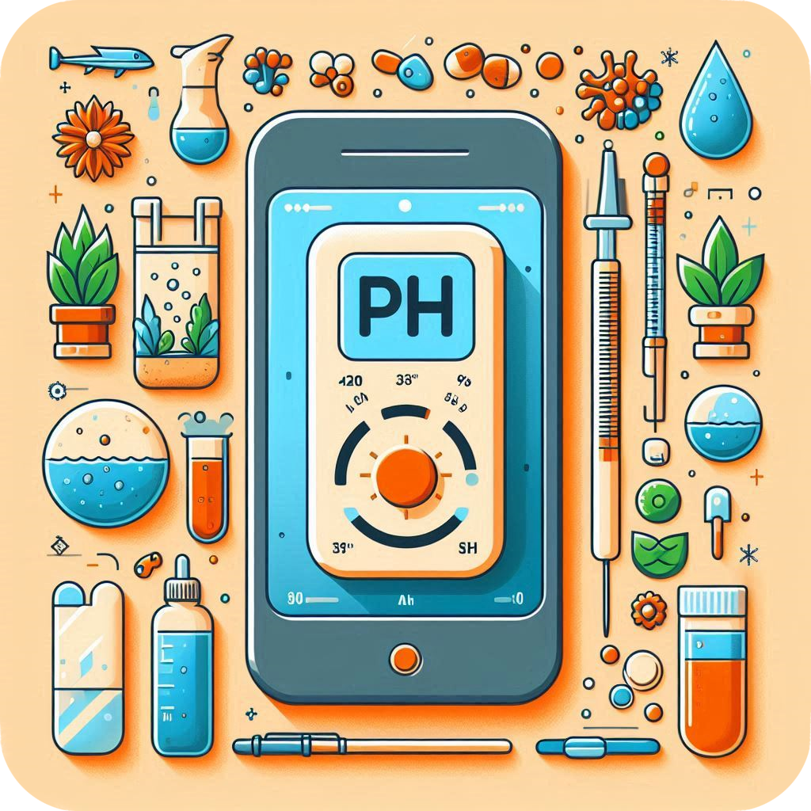

# Jr. Data Analyst/BI Analyst and PhD candidate

Transitioning from a career as a Doctoral Researcher and seeking a full-time role in data analytics and BI. Bringing a strong background in research methodologies, data analysis, and statistical techniques, with hands-on experience in SQL, R programming, spreadsheets and data visualization.

#### Technical Skills: R, Python, SQL, Power BI, Tableau, Statistics

_
## Explore my [Resume Here](Navarro_FE_resume_08_07_2024.pdf)   
<h3 align="right">Connect with me:</h3>

## Projects and Papers
## Index
- [Strategic Insights for a Fictional Bike Share Company: The Cyclistic Bike-Share Project BI](#strategic-insights-for-a-fictional-bike-share-company-the-cyclistic-bike-share-project-bi)
- [Smart Strategies for a Wellness Technology Company: Analyzing Data from a Health and Fitness Device](#smart-strategies-for-a-wellness-technology-company-analyzing-data-from-a-health-and-fitness-device)
- [Usage Insights for a Fictional Bike Share Company: The Cyclistic Bike-Share Project Data Analysis](#usage-insights-for-a-fictional-bike-share-company-the-cyclistic-bike-share-project-data-analysis)
- [Random pH Meter App](#random-ph-meter-app)
- [Power BI](#power-bi)
- [Tableau](#tableau)
- [Published Research](#published-research)

### Strategic Insights for a Bike Share Company: The Cyclistic Bike-Share Project BI

 
Scenario (click here)
  
In this fictional scenario, with real-world data, I’ve joined the business intelligence team at Cyclistic, a fictional bike-share company in New York City. My role involves applying BI principles to analyze and enhance Cyclistic’s bike usage. I handled the data cleaning and processing through ETL (Extract, Transform, Load) using SQL, ensuring the datasets on bike trips and customer demographics are accurate and ready for analysis. I performed exploratory analysis on real-world data and generated insights that lead to actionable recommendations. I created a dashboard to provide insights into bike demand, considering factors like customer type, peak usage times, and weather conditions.

.

#### 1 - Project Documents 

 
 Documents details (click here) 

The Project requirements document describes the overall purpose of the Cyclistic project, including its goals and key dependencies. 
The Stakeholder requirements document outlines key stakeholder needs for developing a BI dashboard. It focuses on understanding customer usage patterns and demand at bike stations to guide strategic decisions for expansion and improvement.
The Strategy document details the BI dashboard development plan, including data sources, user profiles, and dashboard features. It outlines access restrictions, data scope, and key metrics like heat maps and area charts to analyze bike usage, seasonal trends, and weather impacts. The document is in draft and has to be reviewed before implementation.

. 

[Project requirements document (here)](Cyclistic_Bike_share_Project_requirements.pdf)

[Stakeholder requirements document (here)](Cyclistic_Bike_Share_Sakeholders_req.pdf) 

[Strategy document (here)](Cyclistic_Bike_share_Strategy_Document.pdf) 

#### 2 - ETL code and SQL documents

 
 Query details (click here) 

I created the queries for this scenario using BigQuery and leveraged BigQuery’s public datasets to develop the analysis. This approach allowed me to utilize large datasets for comprehensive insights and effective scenario modeling. Also, i uploaded an additional file with the zip codes in NYC. 
The annual query was designed to retrieve annual relevant data; but i had a problem, the zip codes coordinates were not recognized by Tableau, so i had to include them in que query. However, including variables such as stations and coordinates resulted in an excessively large file size that was impractical for download. Therefore, the coordinates were included in a second query to manage the data more efficiently.
Finnaly, the summer query was performed without problems.

.

[Zip codes data (here)](Cyclistic_NYC_zip_codes.csv)

[Annual Query (here)](Cyclistic_query_2022_2023.txt) 

[Zip code coordinates Query (here)](Cyclistic_year_end_lat_long_query.txt)

[Summer Query (here)](Cyclistic_summer_query.txt)

#### 3 - Dashboards

 
 Details (click here) 
 Before creating the dashboards, some calculations were first performed in Tableau 
  
.

[Relationships (here)](Data_relationships_tableau.pdf)

[Dashboards in Tableau (here)](https://public.tableau.com/app/profile/francisco.navarro7243/viz/CyclisticBike-ShareTrends/Story1)

#### 4 - Business Sumary

 
 Details (click here) 
 This summary highlights how subscribers and non-subscribers differ in their usage, seasonal trends in bike usage, and the impact of weather conditions. It also provides actionable insights for strategic bike station placement, congestion management, operational adjustments, marketing, and service optimization to enhance overall performance and customer experience. Please follow the link for the full Business Summary. 
  
.

[Business Sumary (here) ](Cyclistic_business_summary.pdf)

.
### Smart Strategies for a Wellness Technology Company: Analyzing Data from a Health and Fitness Device

 
Scenario (click here)
  
In this project, I analyzed smart device usage trends to inform strategic decisions for a wellness technology company. The focus was on understanding user interactions with smart devices, identifying key health and wellness metrics, and exploring correlations between various indicators. The goal was to leverage trends in health monitoring and personalization to guide marketing strategies and enhance product offerings. I used Python for data analysis and visualization, utilizing libraries such as Seaborn and Matplotlib to generate insightful charts. The findings were compiled into a comprehensive report in Jupyter Notebook, highlighting how the company can leverage these trends to better engage customers and improve their products.

.

#### 1 - Key Objectives:

 
 (click here) 

1 -	Analyze Health Metrics: Examine and compare trends in health data, such as sleep patterns, physical activity, and calorie expenditure, to understand user behavior and device interaction.
  
2 - Identify Usage Trends: Discover patterns in smart device usage, and correlations between health metrics to highlight key user trends.

3 - Enhance Product and Marketing Strategy: Develop actionable recommendations based on data-driven insights to improve product features, optimize user experience, and tailor marketing strategies to better meet user needs and preferences. 

.

#### 2 - Methodology:

 
 (click here) 

This project applied data analysis techniques to clean, transform, and visualize data from a smart device usage dataset. The key steps involved:

A. Data Cleaning:
1 - Deduplication: Removed duplicate rows from the sleep_day dataset (no duplicates found in daily_activity or weight_info).
2 - Handling Missing Values: Addressed missing values, notably removing the 'Fat' column from weight_info due to a high proportion of missing entries.
3 - Date Conversion: Standardized date columns by converting them to datetime format for consistency.
///

B. Data Transformation:
1 - Feature Engineering: Added "Active minutes" and "Active distance" columns to daily_activity by summing related metrics. Added "NoSleepBedMin" to analyze the difference between total time in bed and minutes asleep.
2 - Grouping & Aggregation: Aggregated data by day of the week to analyze average steps, sedentary minutes, calories, and sleep patterns.
///

C. Exploratory Data Analysis (EDA):
1 - Descriptive Statistics: Generated summary statistics to understand central tendencies and variable distributions.
2 - Merging Datasets: Combined daily_activity and sleep_day datasets to explore relationships between activity and sleep. Combined daily_activity and weight_info datasets to explore relationships between activity and weight.
3 - Correlation Analysis: Computed correlation matrices and visualized relationships between activity and health metrics using heatmaps. Explored correlations within the merged dataset to assess the interaction between activity and sleep metrics.
4 - Visualization: Created bar and regression plots to highlight(
  a - Average steps, sedentary minutes, and calories by day.
  b - Sleep metrics (records, minutes asleep, time in bed) by day.
  c - Weight and BMI (Body Mass Index).
  d - Correlations between activity variables, calories, sleep metrics and weight variables.)
///

D. Reporting:
1 - Documentation: The entire process, from data cleaning to transformation and visualization, was documented for clarity and reproducibility.
2 - Key Findings: Summarized insights to support strategic recommendations based on the data analysis.

.

#### 3 - Outcome:

 
 (click here) 
 The analysis of the smart device data uncovered significant insights into user behavior, device performance, and health metrics. Advanced data cleaning, transformation, and visualization techniques highlighted key patterns and correlations between activity levels, sleep quality, and caloric expenditure. The findings reveal opportunities for enhancing product features and personalizing wellness strategies to better meet user needs. By optimizing engagement strategies based on these insights, the project demonstrates a strong capability in data-driven decision-making and provides actionable recommendations that could significantly impact product development and marketing strategies. This project underscores the potential for leveraging data to drive improvements and foster greater user satisfaction.
  
.

#### 4 - Report
 [Look at the report in Python (Click here)](DA_wellnes_tech_company.pdf)
 .

### Usage Insights for a Fictional Bike Share Company: The Cyclistic Bike-Share Project Data Analysis

 
Scenario (click here)
  
In this project, I analyzed how annual members and casual riders use Cyclistic bikes differently to develop strategies for increasing annual memberships. The analysis aimed to uncover patterns in bike usage, understand key differences between membership types, and provide actionable insights for a targeted marketing strategy. I used R for data cleaning and analysis, and Tableau to create visualizations in a dashboard to support the findings. I created a report using R Markdown. Additionally, a version of the report created with Jupyter Notebook, which includes data analysis performed using Python, is also included in the project.

.

#### 1 - Key Objectives:

 
 (click here) 

1 - Analyze Usage Patterns: Explore and compare the usage behavior of annual members versus casual riders.

  
2 - Identify Trends: Determine patterns in bike usage, including frequency, duration, and time of day.

3 - Develop Strategies: Formulate recommendations to convert casual riders into annual members based on data-driven insights. 

.

#### 2 - Methodology:

 
 (click here) 

The project utilized data analysis techniques to clean, transform, and visualize the data. Key steps included:

1 - Data Cleaning: Addressed inconsistencies and missing values.

2 - Exploratory Data Analysis: Conducted descriptive and statistical analyses to identify usage trends.

3 - Visualization: Created visualizations to effectively communicate findings.

4 - Reporting: Documented the analysis process and results to support strategic recommendations.

.

#### 3 - Outcome:

 
 (click here) 
 The findings provided a comprehensive understanding of bike usage patterns, highlighting opportunities for targeted marketing initiatives and membership growth. The project demonstrates proficiency in data analysis, visualization, and strategic planning. 
  
.

#### 4 - Report
[Look at the report in R (Click here)](Data_Analysys_REPORT_Cyclistic_bike_share.pdf)

[Look at the report in Python (Click here)](Cyclistic_Bike_Share_Client_Usage_Report.pdf)

#### 5 - Dashboard
For a more comprehensive analysis, I created a dashboard in Tableau. [Click here to see it](https://public.tableau.com/app/profile/francisco.navarro7243/viz/CiclysticBike-Share/Dashboard1). 

_
### Random pH Meter App
Dive into a bit of scientific fun with this playful pH meter application! Created with Python’s Tkinter and Matplotlib, this app is all about simulating pH measurements with a touch of randomness for entertainment and learning. 

Key features include: (Click here) 

1 - User Interface: The Tkinter-based GUI allows users to input measurement intervals, start and stop measurements, and manage data files with ease.
  
2 - Random Data Simulation: Instead of real measurements, this app generates random pH values within your chosen range. It’s perfect for seeing "how data might look" without the need for actual lab equipment. (Disclaimer: This simulation does not represent an actual laboratory environment.)

3 - Real-Time Data Recording: Simulated measurements are recorded in a CSV file, with automatic saving and real-time updates to a Treeview widget that displays pH values, date, and time.

4 - Visualization: Integrated Matplotlib plots pH values against time, updating dynamically as new simulated data is generated, offering a visual representation of the random measurements.

5 - Data Management: Users can create new files, open existing ones, and save data in a structured CSV format. The application includes options to save files under new names and load previously saved data.

6 - Error Handling: The app is designed to handle input errors and file issues, to provide feedback for invalid input and file operation errors.

This application is designed for fun and educational purposes, providing a simulated experience of pH measurement and data visualization.

.
To access the code [click here](pHCSV.py)

_

### **Power BI** 
#### Project 1: City Bike-Share Client Usage Trends
[View Report](https://app.powerbi.com/view?r=eyJrIjoiNjJlNDQ1MGYtMjVmOS00NDY5LWI0NjEtNzc2ODZiM2I5OGNlIiwidCI6ImEyZTJiYTY0LWUwNTQtNDMxYS1hNWIyLTg5MjJmZjIyN2U3OSIsImMiOjR9)
#### Project 2: Online Sales Data Marketplace
[View Report](https://app.powerbi.com/view?r=eyJrIjoiYjU0MGFlMzktZGFlNC00OGE0LWJmNzUtZTJjMDZhYzU4YmMyIiwidCI6ImEyZTJiYTY0LWUwNTQtNDMxYS1hNWIyLTg5MjJmZjIyN2U3OSIsImMiOjR9)

### **Tableau** 

[View Profile](https://public.tableau.com/app/profile/francisco.navarro7243/vizzes) 

## **Published Research**
[Outdoor culture of *Halamphora coffeaeformis* in the semi-arid Pampa of
Argentina: A comprehensive analysis of triacylglycerol production
for biodiesel](https://doi.org/10.1016/j.algal.2023.103170) in [Algal Research](https://www.sciencedirect.com/journal/algal-research)

[Temperature and Salinity Effect on Tolerance and Lipid Accumulation
in *Halamphora coffeaeformis*: an Approach for Outdoor Bioenergy
Cultures](https://doi.org/10.1007/s12155-021-10349-2) in [BioEnergy Research](https://link.springer.com/journal/12155)

[Three-Dimensional Reconstruction of *Halamphora coffeaeformis* Frustule from Scanning Electron Micrographs](https://doi.org/10.1017/S1431927620001154) in  [Microscopy and Microanalysis](https://www.cambridge.org/core/journals/microscopy-and-microanalysis)

<h3 align="left">Connect with me:</h3>

