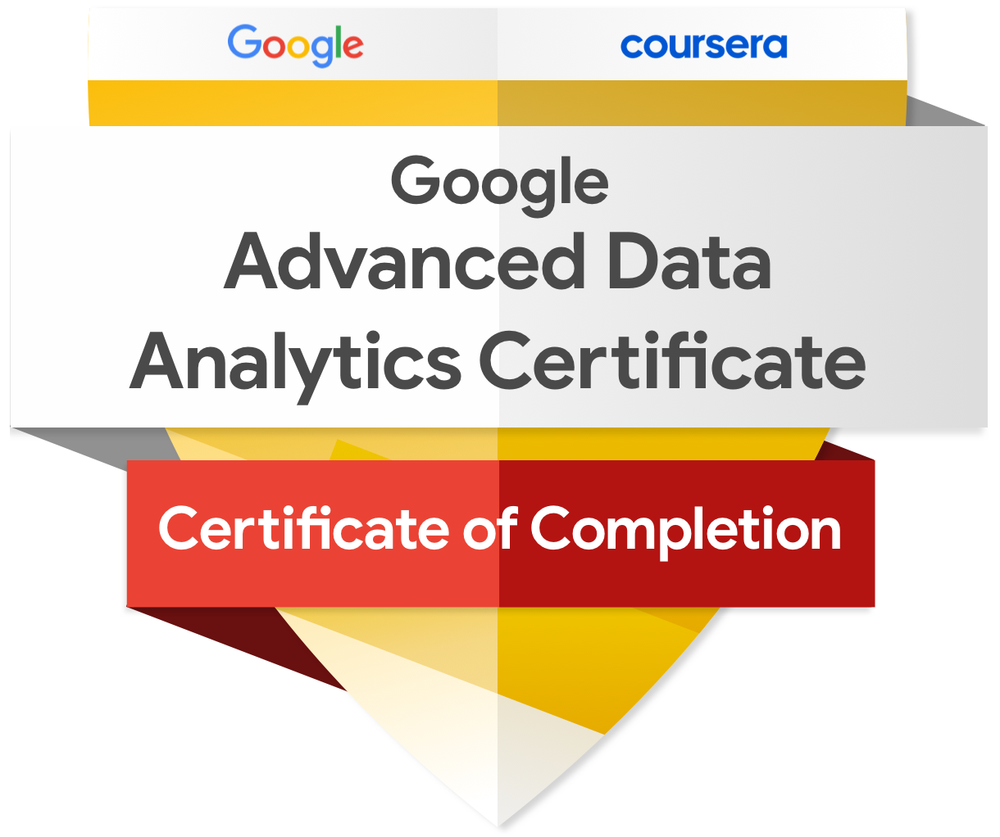
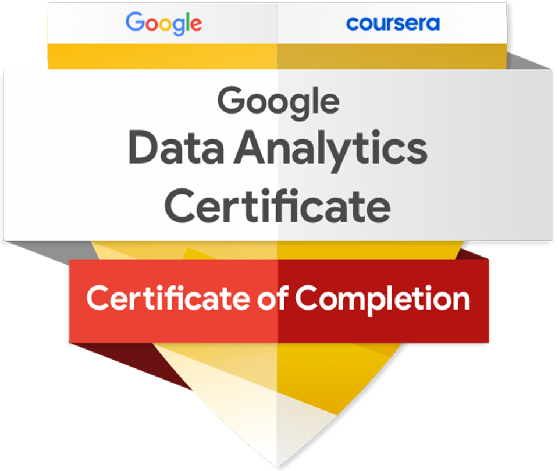
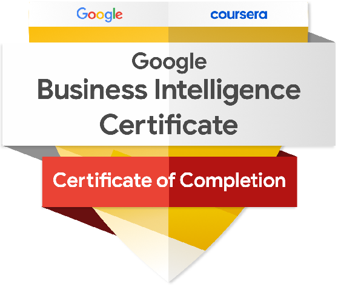

# Data Analyst/ Jr. Data Scientist - PhD

Transitioning from a career as a Doctoral Researcher and seeking a full-time role in data analytics and BI. Bringing a strong background in research methodologies, data analysis, and statistical techniques, with hands-on experience in Python for data analysis, SQL, R programming, spreadsheets and data visualization.

#### Technical Skills: Python, SQL, R, Power BI, Tableau, Statistics

  
  
   
  
  

_

## Explore my [Resume Here](Navarro_FE_resume_080225.pdf)   
<h3 align="right">Connect with me:</h3>

## Projects and Papers
## Index
- [HR project: Predicting Employee Attrition with Machine Learning](#hr-project-predicting-employee-attrition-with-machine-learning) 
<small>Data Cleaning, Exploratory Data Análysis (EDA), Decision Tree, Random Forest, Machine Learning, Python (numpy, pandas, matplotlib, seaborn, plotly, scikit-learn, pickle)</small>

- [TikTok: Claims vs. Opinions. Machine Learning for Classifying User Reports](#tiktok-claims-vs-opinions-machine-learning-for-classifying-user-reports) 
<small>Data Cleaning, Exploratory Data Analysis (EDA), Hypothesis Testing, A/B Testing, Logistic Regression, Random Forest, XGBoost, Machine Learning, Python (numpy, pandas, matplotlib, seaborn, Scipy, statsmodels, scikit-learn, pickle)</small>

- [Business Intelligence project: Strategic Insights for a Bike Share Company](#business-intelligence-project-strategic-insights-for-a-bike-share-company)  
<small>Data Cleaning and Processing (ETL), Exploratory Data Analysis (EDA), Data Visualization, Dashboard Creation, SQL, Tableau.</small>

- [Smart Strategies for a Wellness Technology Company: Analyzing Data from a Health and Fitness Device](#smart-strategies-for-a-wellness-technology-company-analyzing-data-from-a-health-and-fitness-device)   
<small>Data Cleaning and Processing (ETL), Exploratory Data Analysis (EDA), Data Visualization, Statistical Analysis, Report. Python (Pandas, Matplotlib and Seaborn).</small>

- [Usage Insights for a Fictional Bike Share Company: The Cyclistic Bike-Share Project Data Analysis](#usage-insights-for-a-fictional-bike-share-company-the-cyclistic-bike-share-project-data-analysis)  
<small>Data Cleaning and Processing (ETL), Exploratory Data Analysis (EDA), Data Visualization, Report, R (ggplot2, tidyr, dplyr, skimr, janitor, here, lubridate), Python (pandas, numpy, matplotlib, seaborn), Power BI, Tableau.</small>

- [Random pH Meter App](#random-ph-meter-app)
- [Power BI](#power-bi)
- [Tableau](#tableau)
- [Published Research](#published-research)

### HR project: Predicting Employee Attrition with Machine Learning

  

 
Scenario (click here)
  

Employee turnover can be costly for businesses. This project analyzes HR data to identify key factors influencing employee attrition and builds a predictive model using machine learning. By leveraging algorithms like Random Forest and Decision Tree, the project provides data-driven insights to help HR teams improve employee retention strategies. The dataset, sourced from Kaggle, includes job satisfaction, performance evaluations, salary levels, and more. Through exploratory data analysis and model evaluation, this project highlights actionable trends to reduce employee churn.

[Click here to access the project](https://github.com/franeze/HR_RandomForestPy/blob/main/README.md)

.

### TikTok: Claims vs. Opinions. Machine Learning for Classifying User Reports

 
Scenario (click here)
 
This fictional  project aims to support TikTok's report system in classifying user reports of videos as either claims or opinions. The analysis begins with preliminary data exploration, followed by exploratory data analysis (EDA) to identify key trends in user engagement. Hypothesis testing, is performed to validate the impact of different factors on video reports. The project then employs machine learning techniques, including Logistic Regression, Random Forest, and XGBoost, to develop a model for classifying reports. Through these models, the project provides insights into improving TikTok’s content moderation system. The dataset used for this project includes variables such as view, like, and comment counts, sourced directly from TikTok’s platform.

[Click here to access the project](https://github.com/franeze/TikTok_Claim_ML/blob/main/README.md)

.

### Business Intelligence project: Strategic Insights for a Bike Share Company

 
Scenario (click here)
  
In this fictional scenario, with real-world data, I’ve joined the business intelligence team at Cyclistic, a fictional bike-share company in New York City. My role involves applying BI principles to analyze and enhance Cyclistic’s bike usage. I handled the data cleaning and processing through ETL (Extract, Transform, Load) using SQL, ensuring the datasets on bike trips and customer demographics are accurate and ready for analysis. I performed exploratory analysis on real-world data and generated insights that lead to actionable recommendations. I created a dashboard to provide insights into bike demand, considering factors like customer type, peak usage times, and weather conditions.

[Click here to access the project](https://github.com/franeze/Bike_Share_BI/blob/main/README.md)

.
### Smart Strategies for a Wellness Technology Company: Analyzing Data from a Health and Fitness Device

 
Scenario (click here)
  
"In this project, I analyzed smart device usage trends to inform strategic decisions for a wellness technology company. The focus was on understanding user interactions with smart devices, identifying key health and wellness metrics, and exploring correlations between various indicators. The goal was to leverage trends in health monitoring and personalization to guide marketing strategies and enhance product offerings. I used Python for data analysis and visualization, utilizing libraries such as pandas, Seaborn, and Matplotlib to clean, process, and generate insightful charts. The findings were compiled into a comprehensive report in Jupyter Notebook, highlighting how the company can leverage these trends to better engage customers and improve their products."

 [Click here to access the project](https://github.com/franeze/HealthApp_DA/blob/main/README.md)
 
 .

### Usage Insights for a Fictional Bike Share Company: The Cyclistic Bike-Share Project Data Analysis

 
Scenario (click here)
  
In this project, I analyzed how annual members and casual riders use Cyclistic bikes differently to develop strategies for increasing annual memberships. The analysis aimed to uncover patterns in bike usage, understand key differences between membership types, and provide actionable insights for a targeted marketing strategy. I used R for data cleaning and analysis, and Tableau to create visualizations in a dashboard to support the findings. I created a report using R Markdown. Additionally, a version of the report created with Jupyter Notebook, which includes data analysis performed using Python, is also included in the project.

.

#### 1 - Key Objectives:

 
 (click here) 

1 - Analyze Usage Patterns: Explore and compare the usage behavior of annual members versus casual riders.

  
2 - Identify Trends: Determine patterns in bike usage, including frequency, duration, and time of day.

3 - Develop Strategies: Formulate recommendations to convert casual riders into annual members based on data-driven insights. 

.

#### 2 - Methodology:

 
 (click here) 

The project utilized data analysis techniques to clean, transform, and visualize the data. Key steps included:

1 - Data Cleaning: Addressed inconsistencies and missing values.

2 - Exploratory Data Analysis: Conducted descriptive and statistical analyses to identify usage trends.

3 - Visualization: Created visualizations to effectively communicate findings.

4 - Reporting: Documented the analysis process and results to support strategic recommendations.

.

#### 3 - Outcome:

 
 (click here) 
 The findings provided a comprehensive understanding of bike usage patterns, highlighting opportunities for targeted marketing initiatives and membership growth. The project demonstrates proficiency in data analysis, visualization, and strategic planning. 
  
.

#### 4 - Report
[Look at the report in R (Click here)](Data_Analysys_REPORT_Cyclistic_bike_share.pdf)

[Look at the report in Python (Click here)](Cyclistic_Bike_Share_Client_Usage_Report.pdf)

#### 5 - Dashboard

For a more comprehensive analysis, I created a dashboard in Power BI [Click here to see it.](https://app.powerbi.com/view?r=eyJrIjoiNjJlNDQ1MGYtMjVmOS00NDY5LWI0NjEtNzc2ODZiM2I5OGNlIiwidCI6ImEyZTJiYTY0LWUwNTQtNDMxYS1hNWIyLTg5MjJmZjIyN2U3OSIsImMiOjR9)

Additionally, I created a dashboard in Tableau. [Click here to see it](https://public.tableau.com/app/profile/francisco.navarro7243/viz/CiclysticBike-Share/Dashboard1). 

_
### Random pH Meter App
Dive into a bit of scientific fun with this playful pH meter application! Created with Python’s Tkinter and Matplotlib, this app is all about simulating pH measurements with a touch of randomness for entertainment and learning. 

Key features include: (Click here) 

1 - User Interface: The Tkinter-based GUI allows users to input measurement intervals, start and stop measurements, and manage data files with ease.
  
2 - Random Data Simulation: Instead of real measurements, this app generates random pH values within your chosen range. It’s perfect for seeing "how data might look" without the need for actual lab equipment. (Disclaimer: This simulation does not represent an actual laboratory environment.)

3 - Real-Time Data Recording: Simulated measurements are recorded in a CSV file, with automatic saving and real-time updates to a Treeview widget that displays pH values, date, and time.

4 - Visualization: Integrated Matplotlib plots pH values against time, updating dynamically as new simulated data is generated, offering a visual representation of the random measurements.

5 - Data Management: Users can create new files, open existing ones, and save data in a structured CSV format. The application includes options to save files under new names and load previously saved data.

6 - Error Handling: The app is designed to handle input errors and file issues, to provide feedback for invalid input and file operation errors.

This application is designed for fun and educational purposes, providing a simulated experience of pH measurement and data visualization.

.
To access the code [click here](pHCSV.py)

_

### **Power BI** 
#### Project 1: City Bike-Share Client Usage Trends
[View Report](https://app.powerbi.com/view?r=eyJrIjoiNjJlNDQ1MGYtMjVmOS00NDY5LWI0NjEtNzc2ODZiM2I5OGNlIiwidCI6ImEyZTJiYTY0LWUwNTQtNDMxYS1hNWIyLTg5MjJmZjIyN2U3OSIsImMiOjR9)
#### Project 2: Online Sales Data Marketplace
[View Report](https://app.powerbi.com/view?r=eyJrIjoiYjU0MGFlMzktZGFlNC00OGE0LWJmNzUtZTJjMDZhYzU4YmMyIiwidCI6ImEyZTJiYTY0LWUwNTQtNDMxYS1hNWIyLTg5MjJmZjIyN2U3OSIsImMiOjR9)

### **Tableau** 

[View Profile](https://public.tableau.com/app/profile/francisco.navarro7243/vizzes) 

## **Published Research**

[PhD Thesis: Biorrefinería microalgal destinada a la producción sustentable de aceites óptimos para biodiésel y sílice amorfa como un co-producto de valor agregado](https://repositoriodigital.uns.edu.ar/handle/123456789/7065)

[Outdoor culture of *Halamphora coffeaeformis* in the semi-arid Pampa of
Argentina: A comprehensive analysis of triacylglycerol production
for biodiesel](https://doi.org/10.1016/j.algal.2023.103170) in [Algal Research](https://www.sciencedirect.com/journal/algal-research)

[Temperature and Salinity Effect on Tolerance and Lipid Accumulation
in *Halamphora coffeaeformis*: an Approach for Outdoor Bioenergy
Cultures](https://doi.org/10.1007/s12155-021-10349-2) in [BioEnergy Research](https://link.springer.com/journal/12155)

[Three-Dimensional Reconstruction of *Halamphora coffeaeformis* Frustule from Scanning Electron Micrographs](https://doi.org/10.1017/S1431927620001154) in  [Microscopy and Microanalysis](https://www.cambridge.org/core/journals/microscopy-and-microanalysis)

<h3 align="left">Connect with me:</h3>

